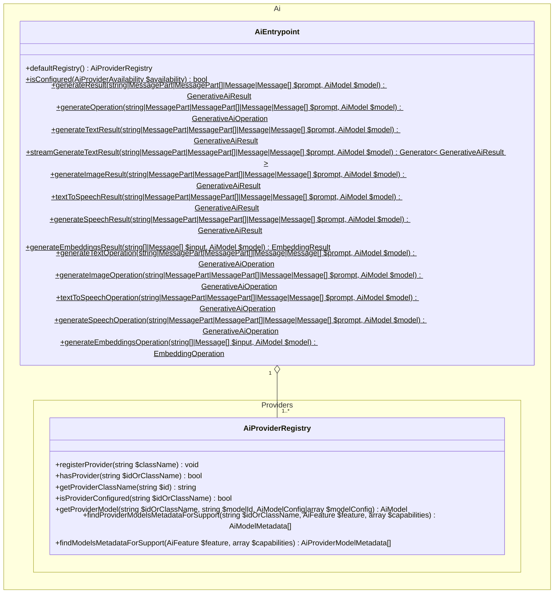

# Architecture

This document outlines the architecture for the PHP AI Client. It is critical that it meets all [requirements](./REQUIREMENTS.md).

## High-level API design

The API design at a high level is heavily inspired by the [Vercel AI SDK](https://github.com/vercel/ai), which is widely used in the NodeJS ecosystem and one of the very few comprehensive AI client SDKs available.

The main additional aspect that the Vercel AI SDK does not cater for easily is for a developer to use AI in a way that the choice of provider remains with the user. To clarify with an example: Instead of "Generate text with Google's model `gemini-2.5-flash`", go with "Generate text using any provider model that supports text generation and multimodal input". In other words, there needs to be a mechanism that allows finding any configured model that supports the given set of required AI features and capabilities.

### Code examples

The following examples indicate how this SDK could eventually be used.

#### Generate text using a Google model

```php
$text = Ai::generateTextResult(
    'Write a 2-verse poem about PHP.',
    Google::model('gemini-2.5-flash')
)->toText();
```

#### Generate multiple text candidates using an Anthropic model

```php
$texts = Ai::generateTextResult(
    'Write a 2-verse poem about PHP.',
    Anthropic::model(
        'claude-3.7-sonnet',
        [TextGenerationConfig::CANDIDATE_COUNT => 4]
    )
)->toTexts();
```

#### Generate an image using any suitable OpenAI model

```php
$modelsMetadata = Ai::defaultRegistry()->findProviderModelsMetadataForSupport(
    'openai',
    AiFeature::IMAGE_GENERATION
);
$imageFile = Ai::generateImageResult(
    'Generate an illustration of the PHP elephant in the Carribean sea.',
    Ai::defaultRegistry()->getProviderModel(
        'openai',
        $modelsMetadata[0]->getId()
    )
)->toImageFile();
```

#### Generate an image using any suitable model from any provider

```php
$providerModelsMetadata = Ai::defaultRegistry()->findModelsMetadataForSupport(
    AiFeature::IMAGE_GENERATION
);
$imageFile = Ai::generateImageResult(
    'Generate an illustration of the PHP elephant in the Carribean sea.',
    Ai::defaultRegistry()->getProviderModel(
        $providerModelsMetadata[0]->getProvider()->getId(),
        $providerModelsMetadata[0]->getModels()[0]->getId()
    )
)->toImageFile();
```

#### Generate embeddings using any suitable model from any provider

```php
$providerModelsMetadata = Ai::defaultRegistry()->findModelsMetadataForSupport(
    AiFeature::EMBEDDING_GENERATION
);
$embeddings = Ai::generateEmbeddingsResult(
    [
        'A very long text.',
        'Another very long text.',
        'More long text.',
    ],
    Ai::defaultRegistry()->getProviderModel(
        $providerModelsMetadata[0]->getProvider()->getId(),
        $providerModelsMetadata[0]->getModels()[0]->getId()
    )
)->getEmbeddings();
```

#### Generate text with JSON output using any suitable model from any provider

```php
$providerModelsMetadata = Ai::defaultRegistry()->findModelsMetadataForSupport(
    AiFeature::TEXT_GENERATION,
    [
        // Make sure the model supports JSON output as well as following a given schema.
        TextGenerationConfig::OUTPUT_MIME_TYPE => 'application/json',
        TextGenerationConfig::OUTPUT_SCHEMA    => true,
    ]
);
$jsonString = Ai::generateTextResult(
    'Transform the following CSV content into a JSON array of row data.',
    Ai::defaultRegistry()->getProviderModel(
        $providerModelsMetadata[0]->getProvider()->getId(),
        $providerModelsMetadata[0]->getModels()[0]->getId(),
        [
            AiModelConfig::GENERATION_CONFIG => [
                TextGenerationConfig::OUTPUT_MIME_TYPE => 'application/json',
                TextGenerationConfig::OUTPUT_SCHEMA    => [
                    'type'  => 'array',
                    'items' => [
                        'type'       => 'object',
                        'properties' => [
                            'name' => [
                                'type' => 'string',
                            ],
                            'age'  => [
                                'type' => 'integer',
                            ],
                        ],
                    ],
                ],
            ],
        ]
    )
)->toText();
```

## Class diagrams

This section shows comprehensive class diagrams for the proposed architecture. For explanation on specific terms, see the [glossary](./GLOSSARY.md).

**Note:** The class diagrams are not meant to be entirely comprehensive in terms of which AI features and capabilities are or will be supported. For now, they simply use "text generation", "image generation", "text to speech", "speech generation", and "embedding generation" for illustrative purposes. Other features like "music generation" or "video generation" etc. would work similarly.

**Note:** The class diagrams are also not meant to be comprehensive in terms of any specific configuration keys or parameters which are or will be supported. For now, the relevant definitions don't include any specific parameter names or constants.

### Zoomed out view

Below you find the zoomed out overview class diagram, looking at the two entrypoints for the largely decoupled APIs for:

- Consuming AI capabilities.
    - This is what the vast majority of developers will use.
- Registering and implementing AI providers.
    - This is what only developers that implement additional models or custom providers will use.

Zoomed in views with detailed specifications for both of the APIs are found in the subsequent sections.



### Class diagram zoomed in on AI consumption

```mermaid
---
config:
  class:
    hideEmptyMembersBox: true
---
classDiagram
direction LR
    namespace Ai {
        class AiEntrypoint {
            +defaultRegistry() AiProviderRegistry
            +isConfigured(AiProviderAvailability $availability) bool$
            +generateResult(string|MessagePart|MessagePart[]|Message|Message[] $prompt, AiModel $model) GenerativeAiResult$
            +generateOperation(string|MessagePart|MessagePart[]|Message|Message[] $prompt, AiModel $model) GenerativeAiOperation$
            +generateTextResult(string|MessagePart|MessagePart[]|Message|Message[] $prompt, AiModel $model) GenerativeAiResult$
            +streamGenerateTextResult(string|MessagePart|MessagePart[]|Message|Message[] $prompt, AiModel $model) Generator< GenerativeAiResult >$
            +generateImageResult(string|MessagePart|MessagePart[]|Message|Message[] $prompt, AiModel $model) GenerativeAiResult$
            +textToSpeechResult(string|MessagePart|MessagePart[]|Message|Message[] $prompt, AiModel $model) GenerativeAiResult$
            +generateSpeechResult(string|MessagePart|MessagePart[]|Message|Message[] $prompt, AiModel $model) GenerativeAiResult$
            +generateEmbeddingsResult(string[]|Message[] $input, AiModel $model) EmbeddingResult$
            +generateTextOperation(string|MessagePart|MessagePart[]|Message|Message[] $prompt, AiModel $model) GenerativeAiOperation$
            +generateImageOperation(string|MessagePart|MessagePart[]|Message|Message[] $prompt, AiModel $model) GenerativeAiOperation$
            +textToSpeechOperation(string|MessagePart|MessagePart[]|Message|Message[] $prompt, AiModel $model) GenerativeAiOperation$
            +generateSpeechOperation(string|MessagePart|MessagePart[]|Message|Message[] $prompt, AiModel $model) GenerativeAiOperation$
            +generateEmbeddingsOperation(string[]|Message[] $input, AiModel $model) EmbeddingOperation$
        }
    }
    namespace Ai.Types {
        class Message {
            +getRole() MessageRole
            +getParts() MessagePart[]
            +getJsonSchema() array< string, mixed >$
        }
        class MessagePart {
            +getType() MessagePartType
            +getText() string?
            +getInlineFile() InlineFile?
            +getRemoteFile() RemoteFile?
            +getFunctionCall() FunctionCall?
            +getFunctionResponse() FunctionResponse?
            +getJsonSchema() array< string, mixed >$
        }
        class File {
        }
        class InlineFile {
            +getMimeType() string
            +getBase64Data() string
            +getJsonSchema() array< string, mixed >$
        }
        class RemoteFile {
            +getMimeType() string
            +getUrl() string
            +getJsonSchema() array< string, mixed >$
        }
        class LocalFile {
            +getMimeType() string
            +getPath() string
            +getJsonSchema() array< string, mixed >$
        }
        class FunctionCall {
            +getId() string
            +getName() string
            +getArgs() array< string, mixed >
            +getJsonSchema() array< string, mixed >$
        }
        class FunctionResponse {
            +getId() string
            +getName() string
            +getResponse() mixed
            +getJsonSchema() array< string, mixed >$
        }
        class Embedding {
            +getVector() float[]
            +getDimension() int
        }
        class Operation {
            +getId() string
            +getState() OperationState
            +getJsonSchema() array< string, mixed >$
        }
        class GenerativeAiOperation {
            +getId() string
            +getState() OperationState
            +getResult() GenerativeAiResult
            +getJsonSchema() array< string, mixed >$
        }
        class EmbeddingOperation {
            +getId() string
            +getState() OperationState
            +getResult() EmbeddingResult
            +getJsonSchema() array< string, mixed >$
        }
        class Result {
            +getId() string
            +getUsage() TokenUsage
            +getProviderMetadata() array< string, mixed >
            +getJsonSchema() array< string, mixed >$
        }
        class GenerativeAiResult {
            +getId() string
            +getCandidates() Candidate[]
            +getUsage() TokenUsage
            +getProviderMetadata() array< string, mixed >
            +getJsonSchema() array< string, mixed >$
            %% The following utility methods transform the result candidates into a specific shape.
            +toText() string
            +toImageFile() File
            +toAudioFile() File
            +toVideoFile() File
            +toMessage() Message
            +toTexts() string[]
            +toImageFiles() File[]
            +toAudioFiles() File[]
            +toVideoFiles() File[]
            +toMessages() Message[]
        }
        class EmbeddingResult {
            +getId() string
            +getEmbeddings() Embedding[]
            +getUsage() TokenUsage
            +getProviderMetadata() array< string, mixed >
            +getJsonSchema() array< string, mixed >$
        }
        class Candidate {
            +getMessage() Message
            +getFinishReason() FinishReason
            +getTokenCount() int
            +getJsonSchema() array< string, mixed >$
        }
        class TokenUsage {
            +getPromptTokens() int
            +getCompletionTokens() int
            +getTotalTokens() int
            +getJsonSchema() array< string, mixed >$
        }
    }
    namespace Ai.Types.Enums {
        class MessageRole {
            USER
            MODEL
            SYSTEM
        }
        class MessagePartType {
            TEXT
            INLINE_FILE
            REMOTE_FILE
            FUNCTION_CALL
            FUNCTION_RESPONSE
        }
        class FinishReason {
            STOP
            LENGTH
            CONTENT_FILTER
            TOOL_CALLS
            ERROR
        }
        class OperationState {
            STARTING
            PROCESSING
            SUCCEEDED
            FAILED
            CANCELED
        }
        class AiModality {
            TEXT
            DOCUMENT
            IMAGE
            AUDIO
            VIDEO
        }
    }
    namespace Ai.Util {
        class MessageUtil {
            +toText(Message $message) string$
            +toImageFile(Message $message) File$
            +toAudioFile(Message $message) File$
            +toVideoFile(Message $message) File$
        }
        class CandidatesUtil {
            +toTexts(Candidate[] $candidates) string[]$
            +toImageFiles(Candidate[] $candidates) File[]$
            +toAudioFiles(Candidate[] $candidates) File[]$
            +toVideoFiles(Candidate[] $candidates) File[]$
            +toFirstText(Candidate[] $candidates) string$
            +toFirstImageFile(Candidate[] $candidates) File$
            +toFirstAudioFile(Candidate[] $candidates) File$
            +toFirstVideoFile(Candidate[] $candidates) File$
        }
    }

    <<interface>> File
    <<interface>> Operation
    <<interface>> Result
    <<Enumeration>> MessageRole
    <<Enumeration>> MessagePartType
    <<Enumeration>> FinishReason
    <<Enumeration>> OperationState
    <<Enumeration>> AiModality

    AiEntrypoint .. Message : receives
    AiEntrypoint .. MessagePart : receives
    AiEntrypoint .. GenerativeAiResult : creates
    AiEntrypoint .. EmbeddingResult : creates
    AiEntrypoint .. GenerativeAiOperation : creates
    AiEntrypoint .. EmbeddingOperation : creates
    Message "1" *-- "1..*" MessagePart
    MessagePart "1" o-- "0..1" InlineFile
    MessagePart "1" o-- "0..1" RemoteFile
    MessagePart "1" o-- "0..1" FunctionCall
    MessagePart "1" o-- "0..1" FunctionResponse
    GenerativeAiOperation "1" o-- "0..1" GenerativeAiResult
    EmbeddingOperation "1" o-- "0..1" EmbeddingResult
    GenerativeAiResult "1" o-- "1..*" Candidate
    GenerativeAiResult "1" o-- "1" TokenUsage
    EmbeddingResult "1" o-- "1..*" Embedding
    EmbeddingResult "1" o-- "1" TokenUsage
    Candidate "1" o-- "1" Message
    Message ..> MessageRole
    MessagePart ..> MessagePartType
    Operation ..> OperationState
    GenerativeAiOperation ..> OperationState
    Candidate ..> FinishReason
    File <|-- InlineFile
    File <|-- RemoteFile
    File <|-- LocalFile
    Operation <|-- GenerativeAiOperation
    Operation <|-- EmbeddingOperation
    Result <|-- GenerativeAiResult
    Result <|-- EmbeddingResult
```



### Class diagram zoomed in on AI provider registration and implementation

```mermaid
---
config:
  class:
    hideEmptyMembersBox: true
---
classDiagram
direction LR
    namespace Ai.Providers {
        class AiProviderRegistry {
            +registerProvider(string $className) void
            +hasProvider(string $idOrClassName) bool
            +getProviderClassName(string $id) string
            +isProviderConfigured(string $idOrClassName) bool
            +getProviderModel(string $idOrClassName, string $modelId, AiModelConfig|array $modelConfig) AiModel
            +findProviderModelsMetadataForSupport(string $idOrClassName, AiFeature $feature, array<string, mixed > $capabilities) AiModelMetadata[]
            +findModelsMetadataForSupport(AiFeature $feature, array<string, mixed > $capabilities) AiProviderModelMetadata[]
        }
    }
    namespace Ai.Providers.Contracts {
        class AiProvider {
            +metadata() AiProviderMetadata$
            +model(string $modelId, AiModelConfig|array< string, mixed > $modelConfig) AiModel$
            +availability() AiProviderAvailability$
            +modelMetadataDirectory() AiModelMetadataDirectory$
        }
        class AiModel {
            +metadata() AiModelMetadata
            +setConfig(AiModelConfig $config) void
            +getConfig() AiModelConfig
            +getSupportedCapabilities() AiCapability[]$
        }
        class AiProviderAvailability {
            +isConfigured() bool
        }
        class AiModelMetadataDirectory {
            +listModelMetadata() AiModelMetadata[]
            +hasModelMetadata(string $modelId) bool
            +getModelMetadata(string $modelId) AiModelMetadata
        }
        class WithGenerativeAiOperations {
            +getOperation(string $operationId) GenerativeAiOperation
        }
        class WithEmbeddingOperations {
            +getOperation(string $operationId) EmbeddingOperation
        }
        class AiTextGenerationModel {
            +generateTextResult(Message[] $prompt) GenerativeAiResult
            +streamGenerateTextResult(Message[] $prompt) Generator< GenerativeAiResult >
        }
        class AiImageGenerationModel {
            +generateImageResult(Message[] $prompt) GenerativeAiResult
        }
        class AiTextToSpeechModel {
            +textToSpeechResult(Message[] $prompt) GenerativeAiResult
        }
        class AiSpeechGenerationModel {
            +generateSpeechResult(Message[] $prompt) GenerativeAiResult
        }
        class AiEmbeddingGenerationModel {
            +generateEmbeddingsResult(Message[] $input) EmbeddingResult
        }
        class AiTextGenerationOperationModel {
            +generateTextOperation(Message[] $prompt) GenerativeAiOperation
        }
        class AiImageGenerationOperationModel {
            +generateImageOperation(Message[] $prompt) GenerativeAiOperation
        }
        class AiTextToSpeechOperationModel {
            +textToSpeechOperation(Message[] $prompt) GenerativeAiOperation
        }
        class AiSpeechGenerationOperationModel {
            +generateSpeechOperation(Message[] $prompt) GenerativeAiOperation
        }
        class AiEmbeddingGenerationOperationModel {
            +generateEmbeddingsOperation(Message[] $input) EmbeddingOperation
        }
        class WithHttpClient {
            +setHttpClient(HttpClient $client) void
            +getHttpClient() HttpClient
        }
        class HttpClient {
            +send(RequestInterface $request, array< string, mixed > $options) ResponseInterface
            +request(string $method, string $uri, array< string, mixed > $options) ResponseInterface
        }
        class WithAuthentication {
            +setAuthentication(Authentication $authentication) void
            +getAuthentication() Authentication
        }
        class Authentication {
            +authenticate(RequestInterface $request) void
            +getJsonSchema() array< string, mixed >$
        }
    }
    namespace Ai.Providers.Types {
        class AiProviderMetadata {
            +getId() string
            +getName() string
            +getType() AiProviderType
            +getJsonSchema() array< string, mixed >$
        }
        class AiModelMetadata {
            +getId() string
            +getName() string
            +getSupportedFeatures() AiFeature[]
            +getSupportedCapabilities() AiCapability[]
            +getJsonSchema() array< string, mixed >$
        }
        class AiProviderModelsMetadata {
            +getProvider() AiProviderMetadata
            +getModels() AiModelMetadata[]
            +getJsonSchema() array< string, mixed >$
        }
        class AiModelConfig {
            +setSystemInstruction(string|MessagePart|MessagePart[]|Message $systemInstruction) void
            +getSystemInstruction() Message?
            +setGenerationConfig(GenerationConfig $config) void
            +getGenerationConfig() GenerationConfig?
            +setTools(Tool[] $tools) void
            +getTools() Tool[]
            +getJsonSchema() array< string, mixed >$
        }
        class GenerationConfig {
            +setValue(string $key, mixed $value) void
            +getValue(string $key) mixed
            +getValues() array< string, mixed >
            +getAdditionalValues() array< string, mixed >
            +getJsonSchema() array< string, mixed >$
        }
        class TextGenerationConfig {
        }
        class ImageGenerationConfig {
        }
        class TextToSpeechConfig {
        }
        class SpeechGenerationConfig {
        }
        class EmbeddingGenerationConfig {
        }
        class Tool {
            +getType() ToolType
            +getFunctionDeclarations() FunctionDeclaration[]?
            +getWebSearch() WebSearch?
            +getJsonSchema() array< string, mixed >$
        }
        class FunctionDeclaration {
            +getName() string
            +getDescription() string
            +getParameters() mixed
            +getJsonSchema() array< string, mixed >$
        }
        class WebSearch {
            +getAllowedDomains() string[]
            +getDisallowedDomains() string[]
            +getJsonSchema() array< string, mixed >$
        }
        class AiCapability {
            +isSupported() bool
            +isSupportedValue(mixed $value) bool
            +getSupportedValues() mixed[]
            +getJsonSchema() array< string, mixed >$
        }
    }
    namespace Ai.Providers.Enums {
        class AiProviderType {
            CLOUD
            SERVER
            CLIENT
        }
        class ToolType {
            FUNCTION_DECLARATIONS
            WEB_SEARCH
        }
        class AiFeature {
            TEXT_GENERATION
            IMAGE_GENERATION
            TEXT_TO_SPEECH
            SPEECH_GENERATION
            MUSIC_GENERATION
            VIDEO_GENERATION
            EMBEDDING_GENERATION
        }
    }
    namespace Ai.Providers.Util {
        class AiFeaturesUtil {
            +getSupportedFeatures(AiModel|string $modelClass) AiFeature[]$
            +getSupportedCapabilities(AiModel|string $modelClass) AiCapability[]$
        }
    }

    <<interface>> AiProvider
    <<interface>> AiModel
    <<interface>> AiProviderAvailability
    <<interface>> AiModelMetadataDirectory
    <<interface>> WithGenerativeAiOperations
    <<interface>> WithEmbeddingOperations
    <<interface>> AiTextGenerationModel
    <<interface>> AiImageGenerationModel
    <<interface>> AiTextToSpeechModel
    <<interface>> AiSpeechGenerationModel
    <<interface>> AiEmbeddingGenerationModel
    <<interface>> AiTextGenerationOperationModel
    <<interface>> AiImageGenerationOperationModel
    <<interface>> AiTextToSpeechOperationModel
    <<interface>> AiSpeechGenerationOperationModel
    <<interface>> AiEmbeddingGenerationOperationModel
    <<interface>> WithHttpClient
    <<interface>> HttpClient
    <<interface>> WithAuthentication
    <<interface>> Authentication
    <<interface>> GenerationConfig
    <<Enumeration>> AiFeature
    <<Enumeration>> AiProviderType

    AiProvider .. AiModel : creates
    AiProvider "1" *-- "1" AiProviderMetadata
    AiProvider "1" *-- "1" AiProviderAvailability
    AiProvider "1" *-- "1" AiModelMetadataDirectory
    AiModel "1" *-- "1" AiModelMetadata
    AiModel "1" *-- "1" AiModelConfig
    AiProviderModelsMetadata "1" o-- "1" AiProviderMetadata
    AiProviderModelsMetadata "1" o-- "1..*" AiModelMetadata
    AiProviderRegistry "1" o-- "0..*" AiProvider
    AiProviderRegistry "1" o-- "0..*" AiProviderMetadata
    AiModelMetadataDirectory "1" o-- "1..*" AiModelMetadata
    AiModelMetadata "1" o-- "1..*" AiFeature
    AiModelMetadata "1" o-- "0..*" AiCapability
    AiModelConfig "1" o-- "0..1" GenerationConfig
    AiModelConfig "1" o-- "0..*" Tool
    Tool "1" o-- "0..*" FunctionDeclaration
    Tool "1" o-- "0..1" WebSearch
    AiProviderMetadata ..> AiProviderType
    AiModelMetadata ..> AiFeature
    AiModel <|-- AiTextGenerationModel
    AiModel <|-- AiImageGenerationModel
    AiModel <|-- AiTextToSpeechModel
    AiModel <|-- AiSpeechGenerationModel
    AiModel <|-- AiEmbeddingGenerationModel
    AiModel <|-- AiTextGenerationOperationModel
    AiModel <|-- AiImageGenerationOperationModel
    AiModel <|-- AiTextToSpeechOperationModel
    AiModel <|-- AiSpeechGenerationOperationModel
    AiModel <|-- AiEmbeddingGenerationOperationModel
    GenerationConfig <|-- TextGenerationConfig
    GenerationConfig <|-- ImageGenerationConfig
    GenerationConfig <|-- TextToSpeechConfig
    GenerationConfig <|-- SpeechGenerationConfig
    GenerationConfig <|-- EmbeddingGenerationConfig
```


