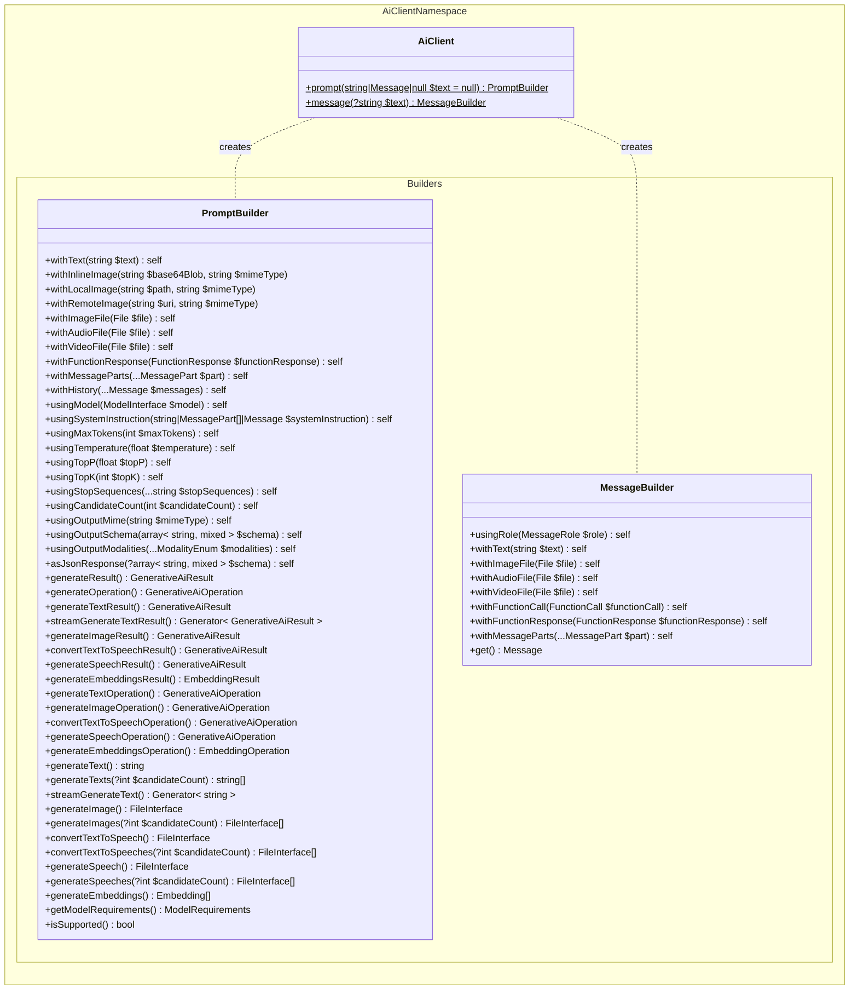
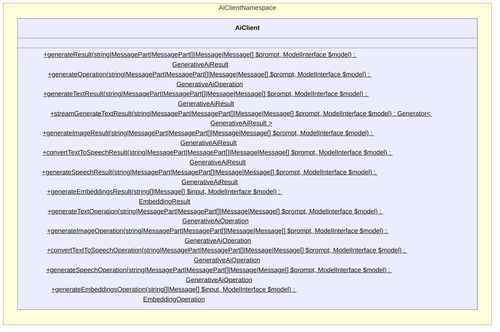
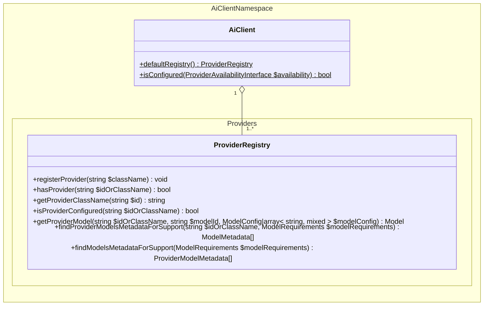
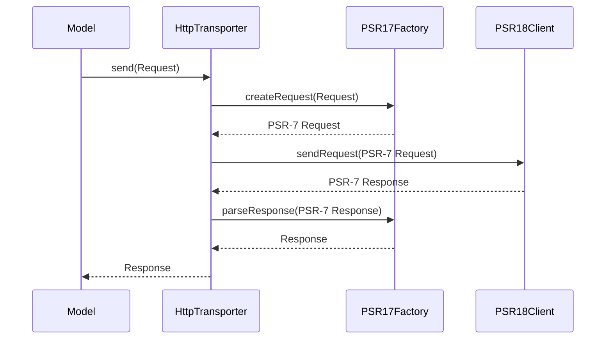
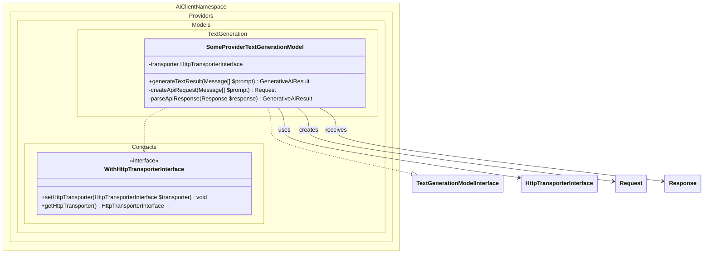

# Architecture

This document outlines the architecture for the PHP AI Client. It is critical that it meets all [requirements](./REQUIREMENTS.md).

## High-level API design

The architecture at a high level is heavily inspired by the [Vercel AI SDK](https://github.com/vercel/ai), which is widely used in the NodeJS ecosystem and one of the very few comprehensive AI client SDKs available.

The main additional aspect that the Vercel AI SDK does not cater for easily is for a developer to use AI in a way that the choice of provider remains with the user. To clarify with an example: Instead of "Generate text with Google's model `gemini-2.5-flash`", go with "Generate text using any provider model that supports text generation and multimodal input". In other words, there needs to be a mechanism that allows finding any configured model that supports the given set of required AI capabilities and options.

For the implementer facing API surface, two alternative APIs are available:

* A fluent API is used as the primary means of using the AI client SDK, for easy-to-read code by chaining declarative methods.
* A traditional method based API inspired by the Vercel AI SDK, which is more aligned with traditional WordPress patterns such as passing an array of arguments.

### Code examples

The following examples indicate how this SDK could eventually be used.

#### Generate text using any suitable model from any provider (most basic example)

##### Fluent API
```php
$text = AiClient::prompt('Write a 2-verse poem about PHP.')
    ->generateText();
```

##### Traditional API
```php
$text = AiClient::generateTextResult(
    'Write a 2-verse poem about PHP.'
)->toText();
```

#### Generate text using a Google model

##### Fluent API
```php
$text = AiClient::prompt('Write a 2-verse poem about PHP.')
    ->usingModel(Google::model('gemini-2.5-flash'))
    ->generateText();
```

##### Traditional API
```php
$text = AiClient::generateTextResult(
    'Write a 2-verse poem about PHP.',
    Google::model('gemini-2.5-flash')
)->toText();
```

#### Generate multiple text candidates using an Anthropic model

##### Fluent API
```php
$texts = AiClient::prompt('Write a 2-verse poem about PHP.')
    ->usingModel(Anthropic::model('claude-3.7-sonnet'))
    ->generateTexts(4);
```

##### Traditional API
```php
$texts = AiClient::generateTextResult(
    'Write a 2-verse poem about PHP.',
    Anthropic::model(
        'claude-3.7-sonnet',
        [OptionEnum::CANDIDATE_COUNT => 4]
    )
)->toTexts();
```

#### Generate an image using any suitable OpenAI model

##### Fluent API
```php
$imageFile = AiClient::prompt('Generate an illustration of the PHP elephant in the Carribean sea.')
    ->usingProvider('openai')
    ->generateImage();
```

##### Traditional API
```php
$modelsMetadata = AiClient::defaultRegistry()->findProviderModelsMetadataForSupport(
    'openai',
    new ModelRequirements([CapabilityEnum::IMAGE_GENERATION])
);
$imageFile = AiClient::generateImageResult(
    'Generate an illustration of the PHP elephant in the Carribean sea.',
    AiClient::defaultRegistry()->getProviderModel(
        'openai',
        $modelsMetadata[0]->getId()
    )
)->toImageFile();
```

#### Generate an image using any suitable model from any provider

##### Fluent API
```php
$imageFile = AiClient::prompt('Generate an illustration of the PHP elephant in the Carribean sea.')
    ->generateImage();
```

##### Traditional API
```php
$providerModelsMetadata = AiClient::defaultRegistry()->findModelsMetadataForSupport(
    new ModelRequirements([CapabilityEnum::IMAGE_GENERATION])
);
$imageFile = AiClient::generateImageResult(
    'Generate an illustration of the PHP elephant in the Carribean sea.',
    AiClient::defaultRegistry()->getProviderModel(
        $providerModelsMetadata[0]->getProvider()->getId(),
        $providerModelsMetadata[0]->getModels()[0]->getId()
    )
)->toImageFile();
```

#### Generate text using any suitable model from any provider

_Note: This does effectively the exact same as [the first code example](#generate-text-using-any-suitable-model-from-any-provider-most-basic-example), but more verbosely. In other words, if you omit the model parameter, the SDK will do this internally._

##### Fluent API
```php
$providerModelsMetadata = AiClient::defaultRegistry()->findModelsMetadataForSupport(
    new ModelRequirements([CapabilityEnum::TEXT_GENERATION])
);

$text = AiClient::prompt('Write a 2-verse poem about PHP.')
    ->withModel(
        AiClient::defaultRegistry()->getProviderModel(
            $providerModelsMetadata[0]->getProvider()->getId(),
            $providerModelsMetadata[0]->getModels()[0]->getId()
        )
    )
    ->generateText();
```

##### Traditional API
```php
$providerModelsMetadata = AiClient::defaultRegistry()->findModelsMetadataForSupport(
    new ModelRequirements([CapabilityEnum::TEXT_GENERATION])
);
$text = AiClient::generateTextResult(
    'Write a 2-verse poem about PHP.',
    AiClient::defaultRegistry()->getProviderModel(
        $providerModelsMetadata[0]->getProvider()->getId(),
        $providerModelsMetadata[0]->getModels()[0]->getId()
    )
)->toText();
```

#### Generate text with an image as additional input using any suitable model from any provider

_Note: Since this omits the model parameter, the SDK will automatically determine which models are suitable and use any of them, similar to [the first code example](#generate-text-using-any-suitable-model-from-any-provider-most-basic-example). Since it knows the input includes an image, it can internally infer that the model needs to not only support `CapabilityEnum::TEXT_GENERATION`, but also `OptionEnum::INPUT_MODALITIES => ['text', 'image']`._

##### Fluent API
```php
$text = AiClient::prompt('Generate alternative text for this image.')
    ->withInlineImage($base64Blob, 'image/png')
    ->generateText();
```

##### Traditional API
```php
$text = AiClient::generateTextResult(
    [
        [
            'text' => 'Generate alternative text for this image.',
        ],
        [
            'mimeType'   => 'image/png',
            'base64Data' => '...', // Base64-encoded data blob.
        ],
    ]
)->toText();
```

#### Generate text with chat history using any suitable model from any provider

_Note: Similarly to the previous example, even without specifying the model here, the SDK will be able to infer required model capabilities because it can detect that multiple chat messages are passed. Therefore it will internally only consider models that support `CapabilityEnum::TEXT_GENERATION` as well as `CapabilityEnum::CHAT_HISTORY`._

##### Fluent API
```php
$text = AiClient::prompt()
    ->withHistory(
        new UserMessage('Do you spell it WordPress or Wordpress?'),
        new ModelMessage('The correct spelling is WordPress.'),
    )
    ->withText('Can you repeat that please?')
    ->generateText();
```

##### Traditional API
```php
$text = AiClient::generateTextResult(
    [
        [
            'role'  => MessageRoleEnum::USER,
            'parts' => ['text' => 'Do you spell it WordPress or Wordpress?'],
        ],
        [
            'role'  => MessageRoleEnum::MODEL,
            'parts' => ['text' => 'The correct spelling is WordPress.'],
        ],
        [
            'role'  => MessageRoleEnum::USER,
            'parts' => ['text' => 'Can you repeat that please?'],
        ],
    ]
)->toText();
```

#### Generate text with JSON output using any suitable model from any provider

_Note: Unlike the previous two examples, to require JSON output it is necessary to go the verbose route, since it is impossible for the SDK to detect whether you require JSON output purely from the prompt input. Therefore this code example contains the logic to manually search for suitable models and then use one of them for the task._

##### Fluent API
```php
$text = AiClient::prompt('Transform the following CSV content into a JSON array of row data.')
    ->asJsonResponse()
    ->usingOutputSchema([
        'type'  => 'array',
        'items' => [
            'type'       => 'object',
            'properties' => [
                'name' => [
                    'type' => 'string',
                ],
                'age'  => [
                    'type' => 'integer',
                ],
            ],
        ],
    ])
    ->generateText();
```

##### Traditional API
```php
$providerModelsMetadata = AiClient::defaultRegistry()->findModelsMetadataForSupport(
    new ModelRequirements(
        [CapabilityEnum::TEXT_GENERATION],
        [
            // Make sure the model supports JSON output as well as following a given schema.
            OptionEnum::OUTPUT_MIME_TYPE => 'application/json',
            OptionEnum::OUTPUT_SCHEMA    => true,
        ]
    )
);
$jsonString = AiClient::generateTextResult(
    'Transform the following CSV content into a JSON array of row data.',
    AiClient::defaultRegistry()->getProviderModel(
        $providerModelsMetadata[0]->getProvider()->getId(),
        $providerModelsMetadata[0]->getModels()[0]->getId(),
        [
            OptionEnum::OUTPUT_MIME_TYPE => 'application/json',
            OptionEnum::OUTPUT_SCHEMA    => [
                'type'  => 'array',
                'items' => [
                    'type'       => 'object',
                    'properties' => [
                        'name' => [
                            'type' => 'string',
                        ],
                        'age'  => [
                            'type' => 'integer',
                        ],
                    ],
                ],
            ],
        ]
    )
)->toText();
```

## Class diagrams

This section shows comprehensive class diagrams for the proposed architecture. For explanation on specific terms, see the [glossary](./GLOSSARY.md).

**Note:** The class diagrams are not meant to be entirely comprehensive in terms of which AI features and capabilities are or will be supported. For now, they simply use "text generation", "image generation", "text to speech", "speech generation", and "embedding generation" for illustrative purposes. Other features like "music generation" or "video generation" etc. would work similarly.

**Note:** The class diagrams are also not meant to be comprehensive in terms of any specific configuration keys or parameters which are or will be supported. For now, the relevant definitions don't include any specific parameter names or constants.

### Overview: Fluent API for AI implementers

This is a subset of the overall class diagram, purely focused on the fluent API for AI implementers.



### Overview: Traditional method call API for AI implementers

This is a subset of the overall class diagram, purely focused on the traditional method call API for AI implementers.



### Overview: API for AI extenders

This is a subset of the overall class diagram, purely focused on the API for AI extenders.



### Details: Class diagram for AI implementers

```mermaid
---
config:
  class:
    hideEmptyMembersBox: true
---
classDiagram
direction LR
    namespace AiClientNamespace {
        class AiClient {
            +prompt(string|Message|null $text = null) PromptBuilder$
            +message(?string $text) MessageBuilder$
            +defaultRegistry() ProviderRegistry$
            +isConfigured(ProviderAvailabilityInterface $availability) bool$
            +generateResult(string|MessagePart|MessagePart[]|Message|Message[] $prompt, ModelInterface $model) GenerativeAiResult$
            +generateOperation(string|MessagePart|MessagePart[]|Message|Message[] $prompt, ModelInterface $model) GenerativeAiOperation$
            +generateTextResult(string|MessagePart|MessagePart[]|Message|Message[] $prompt, ModelInterface $model) GenerativeAiResult$
            +streamGenerateTextResult(string|MessagePart|MessagePart[]|Message|Message[] $prompt, ModelInterface $model) Generator< GenerativeAiResult >$
            +generateImageResult(string|MessagePart|MessagePart[]|Message|Message[] $prompt, ModelInterface $model) GenerativeAiResult$
            +convertTextToSpeechResult(string|MessagePart|MessagePart[]|Message|Message[] $prompt, ModelInterface $model) GenerativeAiResult$
            +generateSpeechResult(string|MessagePart|MessagePart[]|Message|Message[] $prompt, ModelInterface $model) GenerativeAiResult$
            +generateEmbeddingsResult(string[]|Message[] $input, ModelInterface $model) EmbeddingResult$
            +generateTextOperation(string|MessagePart|MessagePart[]|Message|Message[] $prompt, ModelInterface $model) GenerativeAiOperation$
            +generateImageOperation(string|MessagePart|MessagePart[]|Message|Message[] $prompt, ModelInterface $model) GenerativeAiOperation$
            +convertTextToSpeechOperation(string|MessagePart|MessagePart[]|Message|Message[] $prompt, ModelInterface $model) GenerativeAiOperation$
            +generateSpeechOperation(string|MessagePart|MessagePart[]|Message|Message[] $prompt, ModelInterface $model) GenerativeAiOperation$
            +generateEmbeddingsOperation(string[]|Message[] $input, ModelInterface $model) EmbeddingOperation$
        }
    }

    namespace AiClientNamespace.Builders {
        class PromptBuilder {
            +withText(string $text) self
            +withInlineImage(string $base64Blob, string $mimeType)
            +withLocalImage(string $path, string $mimeType)
            +withRemoteImage(string $uri, string $mimeType)
            +withImageFile(File $file) self
            +withAudioFile(File $file) self
            +withVideoFile(File $file) self
            +withFunctionResponse(FunctionResponse $functionResponse) self
            +withMessageParts(...MessagePart $part) self
            +withHistory(...Message $messages) self
            +usingModel(ModelInterface $model) self
            +usingSystemInstruction(string|MessagePart[]|Message $systemInstruction) self
            +usingMaxTokens(int $maxTokens) self
            +usingTemperature(float $temperature) self
            +usingTopP(float $topP) self
            +usingTopK(int $topK) self
            +usingStopSequences(...string $stopSequences) self
            +usingCandidateCount(int $candidateCount) self
            +usingOutputMime(string $mimeType) self
            +usingOutputSchema(array< string, mixed > $schema) self
            +usingOutputModalities(...ModalityEnum $modalities) self
            +asJsonResponse(?array< string, mixed > $schema) self
            +generateResult() GenerativeAiResult
            +generateOperation() GenerativeAiOperation
            +generateTextResult() GenerativeAiResult
            +streamGenerateTextResult() Generator< GenerativeAiResult >
            +generateImageResult() GenerativeAiResult
            +convertTextToSpeechResult() GenerativeAiResult
            +generateSpeechResult() GenerativeAiResult
            +generateEmbeddingsResult() EmbeddingResult
            +generateTextOperation() GenerativeAiOperation
            +generateImageOperation() GenerativeAiOperation
            +convertTextToSpeechOperation() GenerativeAiOperation
            +generateSpeechOperation() GenerativeAiOperation
            +generateEmbeddingsOperation() EmbeddingOperation
            +generateText() string
            +generateTexts(?int $candidateCount) string[]
            +streamGenerateText() Generator< string >
            +generateImage() FileInterface
            +generateImages(?int $candidateCount) FileInterface[]
            +convertTextToSpeech() FileInterface
            +convertTextToSpeeches(?int $candidateCount) FileInterface[]
            +generateSpeech() FileInterface
            +generateSpeeches(?int $candidateCount) FileInterface[]
            +generateEmbeddings() Embedding[]
            +getModelRequirements() ModelRequirements
            +isSupported() bool
        }

        class MessageBuilder {
            +usingRole(MessageRole $role) self
            +withText(string $text) self
            +withImageFile(File $file) self
            +withAudioFile(File $file) self
            +withVideoFile(File $file) self
            +withFunctionCall(FunctionCall $functionCall) self
            +withFunctionResponse(FunctionResponse $functionResponse) self
            +withMessageParts(...MessagePart $part) self
            +get() Message
        }
    }

    namespace AiClientNamespace.Embeddings.DTO {
        class Embedding {
            +getVector() float[]
            +getDimension() int
        }
    }

    namespace AiClientNamespace.Files.Contracts {
        class FileInterface {
        }
    }

    namespace AiClientNamespace.Files.DTO {
        class InlineFile {
            +getMimeType() string
            +getBase64Data() string
            +getJsonSchema() array< string, mixed >$
        }
        class LocalFile {
            +getMimeType() string
            +getPath() string
            +getJsonSchema() array< string, mixed >$
        }
        class RemoteFile {
            +getMimeType() string
            +getUrl() string
            +getJsonSchema() array< string, mixed >$
        }
    }

    namespace AiClientNamespace.Messages.DTO {
        class Message {
            +getRole() MessageRoleEnum
            +getParts() MessagePart[]
            +getJsonSchema() array< string, mixed >$
        }
        class MessagePart {
            +getType() MessagePartTypeEnum
            +getText() string?
            +getInlineFile() InlineFile?
            +getRemoteFile() RemoteFile?
            +getFunctionCall() FunctionCall?
            +getFunctionResponse() FunctionResponse?
            +getJsonSchema() array< string, mixed >$
        }
        class ModelMessage {
        }
        class SystemMessage {
        }
        class UserMessage {
        }
    }

    namespace AiClientNamespace.Messages.Enums {
        class MessagePartTypeEnum {
            TEXT
            INLINE_FILE
            REMOTE_FILE
            FUNCTION_CALL
            FUNCTION_RESPONSE
        }
        class MessageRoleEnum {
            USER
            MODEL
            SYSTEM
        }
        class ModalityEnum {
            TEXT
            DOCUMENT
            IMAGE
            AUDIO
            VIDEO
        }
    }

    namespace AiClientNamespace.Operations.Contracts {
        class OperationInterface {
            +getId() string
            +getState() OperationStateEnum
            +getJsonSchema() array< string, mixed >$
        }
    }

    namespace AiClientNamespace.Operations.Enums {
        class OperationStateEnum {
            STARTING
            PROCESSING
            SUCCEEDED
            FAILED
            CANCELED
        }
    }

    namespace AiClientNamespace.Operations.DTO {
        class EmbeddingOperation {
            +getId() string
            +getState() OperationStateEnum
            +getResult() EmbeddingResult
            +getJsonSchema() array< string, mixed >$
        }
        class GenerativeAiOperation {
            +getId() string
            +getState() OperationStateEnum
            +getResult() GenerativeAiResult
            +getJsonSchema() array< string, mixed >$
        }
    }

    namespace AiClientNamespace.Results.Contracts {
        class ResultInterface {
            +getId() string
            +getTokenUsage() TokenUsage
            +getProviderMetadata() array< string, mixed >
            +getJsonSchema() array< string, mixed >$
        }
    }

    namespace AiClientNamespace.Results.DTO {
        class Candidate {
            +getMessage() Message
            +getFinishReason() FinishReasonEnum
            +getTokenCount() int
            +getJsonSchema() array< string, mixed >$
        }
        class EmbeddingResult {
            +getId() string
            +getEmbeddings() Embedding[]
            +getTokenUsage() TokenUsage
            +getProviderMetadata() array< string, mixed >
            +getJsonSchema() array< string, mixed >$
        }
        class GenerativeAiResult {
            +getId() string
            +getCandidates() Candidate[]
            +getTokenUsage() TokenUsage
            +getProviderMetadata() array< string, mixed >
            +getJsonSchema() array< string, mixed >$
            %% The following utility methods transform the result candidates into a specific shape.
            +toText() string
            +toImageFile() FileInterface
            +toAudioFile() FileInterface
            +toVideoFile() FileInterface
            +toMessage() Message
            +toTexts() string[]
            +toImageFiles() FileInterface[]
            +toAudioFiles() FileInterface[]
            +toVideoFiles() FileInterface[]
            +toMessages() Message[]
        }
        class TokenUsage {
            +getPromptTokens() int
            +getCompletionTokens() int
            +getTotalTokens() int
            +getJsonSchema() array< string, mixed >$
        }
    }

    namespace AiClientNamespace.Results.Enums {
        class FinishReasonEnum {
            STOP
            LENGTH
            CONTENT_FILTER
            TOOL_CALLS
            ERROR
        }
    }

    namespace AiClientNamespace.Tools.DTO {
        class FunctionCall {
            +getId() string
            +getName() string
            +getArgs() array< string, mixed >
            +getJsonSchema() array< string, mixed >$
        }
        class FunctionDeclaration {
            +getName() string
            +getDescription() string
            +getParameters() mixed
            +getJsonSchema() array< string, mixed >$
        }
        class FunctionResponse {
            +getId() string
            +getName() string
            +getResponse() mixed
            +getJsonSchema() array< string, mixed >$
        }
        class Tool {
            +getType() ToolType
            +getFunctionDeclarations() FunctionDeclaration[]?
            +getWebSearch() WebSearch?
            +getJsonSchema() array< string, mixed >$
        }
        class WebSearch {
            +getAllowedDomains() string[]
            +getDisallowedDomains() string[]
            +getJsonSchema() array< string, mixed >$
        }
    }

    namespace AiClientNamespace.Util {
        class CandidatesUtil {
            +toTexts(Candidate[] $candidates) string[]$
            +toImageFiles(Candidate[] $candidates) FileInterface[]$
            +toAudioFiles(Candidate[] $candidates) FileInterface[]$
            +toVideoFiles(Candidate[] $candidates) FileInterface[]$
            +toFirstText(Candidate[] $candidates) string$
            +toFirstImageFile(Candidate[] $candidates) FileInterface$
            +toFirstAudioFile(Candidate[] $candidates) FileInterface$
            +toFirstVideoFile(Candidate[] $candidates) FileInterface$
        }
        class MessageUtil {
            +toText(Message $message) string$
            +toImageFile(Message $message) FileInterface$
            +toAudioFile(Message $message) FileInterface$
            +toVideoFile(Message $message) FileInterface$
        }
        class RequirementsUtil {
            +inferRequirements(Message[] $messages, ModelConfig $modelConfig) ModelRequirements$
        }
    }

    <<interface>> FileInterface
    <<interface>> OperationInterface
    <<interface>> ResultInterface
    <<Enumeration>> MessageRoleEnum
    <<Enumeration>> MessagePartTypeEnum
    <<Enumeration>> FinishReasonEnum
    <<Enumeration>> OperationStateEnum
    <<Enumeration>> ModalityEnum

    AiClient .. Message : receives
    AiClient .. MessagePart : receives
    AiClient .. PromptBuilder : creates
    AiClient .. MessageBuilder : creates
    AiClient .. GenerativeAiResult : creates
    AiClient .. EmbeddingResult : creates
    AiClient .. GenerativeAiOperation : creates
    AiClient .. EmbeddingOperation : creates
    PromptBuilder .. GenerativeAiResult : creates
    PromptBuilder .. EmbeddingResult : creates
    PromptBuilder .. GenerativeAiOperation : creates
    PromptBuilder .. EmbeddingOperation : creates
    MessageBuilder .. Message : creates
    Message "1" *-- "1..*" MessagePart
    MessagePart "1" o-- "0..1" InlineFile
    MessagePart "1" o-- "0..1" RemoteFile
    MessagePart "1" o-- "0..1" FunctionCall
    MessagePart "1" o-- "0..1" FunctionResponse
    GenerativeAiOperation "1" o-- "0..1" GenerativeAiResult
    EmbeddingOperation "1" o-- "0..1" EmbeddingResult
    GenerativeAiResult "1" o-- "1..*" Candidate
    GenerativeAiResult "1" o-- "1" TokenUsage
    EmbeddingResult "1" o-- "1..*" Embedding
    EmbeddingResult "1" o-- "1" TokenUsage
    Candidate "1" o-- "1" Message
    Message ..> MessageRoleEnum
    MessagePart ..> MessagePartTypeEnum
    OperationInterface ..> OperationStateEnum
    GenerativeAiOperation ..> OperationStateEnum
    Candidate ..> FinishReasonEnum
    FileInterface <|-- InlineFile
    FileInterface <|-- RemoteFile
    FileInterface <|-- LocalFile
    Message <|-- UserMessage
    Message <|-- ModelMessage
    Message <|-- SystemMessage
    OperationInterface <|-- GenerativeAiOperation
    OperationInterface <|-- EmbeddingOperation
    ResultInterface <|-- GenerativeAiResult
    ResultInterface <|-- EmbeddingResult
    Tool "1" o-- "0..*" FunctionDeclaration
    Tool "1" o-- "0..1" WebSearch
```



## HTTP Communication Layer

This section describes the HTTP communication architecture that differs from the original design. Instead of models directly using PSR-18 HTTP clients, we introduce a layer of abstraction that provides better separation of concerns and flexibility.

### Design Principles

1. **Custom Request/Response Objects**: Models create and receive custom Request and Response objects specific to this library
2. **HttpTransporter**: A dedicated class that handles the translation between custom objects and PSR standards
3. **HTTPlug Integration**: Uses HTTPlug's Discovery component for automatic detection of available HTTP clients and factories
4. **PSR Compliance**: The transporter uses PSR-7 (HTTP messages), PSR-17 (HTTP factories), and PSR-18 (HTTP client) internally
5. **No Direct Coupling**: The library remains decoupled from any specific HTTP client implementation
6. **Provider Domain Location**: HTTP components are located within the Providers domain (`src/Providers/Http/`) as they are provider-specific infrastructure
7. **Synchronous Only**: Currently supports only synchronous HTTP requests. Async support may be added in the future if needed

### HTTP Communication Flow



### HTTP Components Class Diagram

```mermaid
---
config:
  class:
    hideEmptyMembersBox: true
---
classDiagram
direction TB
    namespace AiClientNamespace.Providers.Http.DTO {
        class Request {
            +getMethod() string
            +getUri() string
            +getHeaders() array< string, string|string[] >
            +getBody() string|null
            +withHeader(string $name, string|string[] $value) self
            +withBody(string $body) self
            +getJsonSchema() array< string, mixed >$
        }
        
        class Response {
            +getStatusCode() int
            +getHeaders() array< string, string|string[] >
            +getBody() string
            +getReasonPhrase() string
            +isSuccessful() bool
            +getJsonSchema() array< string, mixed >$
        }
    }
    
    namespace AiClientNamespace.Providers.Http.Contracts {
        class HttpTransporterInterface {
            +send(Request $request) Response
        }
    }
    
    namespace AiClientNamespace.Providers.Http {
        class HttpTransporter {
            -requestFactory Psr17RequestFactoryInterface
            -streamFactory Psr17StreamFactoryInterface  
            -client Psr18ClientInterface
            +__construct(?Psr18ClientInterface $client, ?Psr17RequestFactoryInterface $requestFactory, ?Psr17StreamFactoryInterface $streamFactory)
            +send(Request $request) Response
            -convertToPsr7Request(Request $request) Psr7RequestInterface
            -convertFromPsr7Response(Psr7ResponseInterface $response) Response
        }
        
        class HttpTransporterFactory {
            +createTransporter() HttpTransporterInterface$
        }
    }
    
    namespace PSR {
        class Psr17RequestFactoryInterface {
            <<interface>>
            +createRequest(string $method, UriInterface|string $uri) RequestInterface
        }
        
        class Psr17StreamFactoryInterface {
            <<interface>>
            +createStream(string $content) StreamInterface
        }
        
        class Psr18ClientInterface {
            <<interface>>
            +sendRequest(RequestInterface $request) ResponseInterface
        }
        
        class Psr7RequestInterface {
            <<interface>>
        }
        
        class Psr7ResponseInterface {
            <<interface>>
        }
    }
    
    <<interface>> HttpTransporterInterface
    
    HttpTransporter ..|> HttpTransporterInterface
    HttpTransporter --> Psr17RequestFactoryInterface : uses
    HttpTransporter --> Psr17StreamFactoryInterface : uses
    HttpTransporter --> Psr18ClientInterface : uses
    HttpTransporterFactory ..> HttpTransporter : creates
    HttpTransporter ..> Request : receives
    HttpTransporter ..> Response : creates
    HttpTransporter ..> Psr7RequestInterface : creates
    HttpTransporter ..> Psr7ResponseInterface : receives
```



### Integration with Models

Models that need HTTP communication will use the `HttpTransporterInterface`:



### Details: Class diagram for AI extenders

```mermaid
---
config:
  class:
    hideEmptyMembersBox: true
---
classDiagram
direction LR
    namespace AiClientNamespace.Providers {
        class ProviderRegistry {
            +registerProvider(string $className) void
            +hasProvider(string $idOrClassName) bool
            +getProviderClassName(string $id) string
            +isProviderConfigured(string $idOrClassName) bool
            +getProviderModel(string $idOrClassName, string $modelId, ModelConfig|array< string, mixed > $modelConfig) ModelInterface
            +findProviderModelsMetadataForSupport(string $idOrClassName, ModelRequirements $modelRequirements) ModelMetadata[]
            +findModelsMetadataForSupport(ModelRequirements $modelRequirements) AiProviderModelMetadata[]
        }
    }

    namespace AiClientNamespace.Providers.Contracts {
        class AuthenticationInterface {
            +authenticate(Request $request) void
            +getJsonSchema() array< string, mixed >$
        }
        class ModelMetadataDirectoryInterface {
            +listModelMetadata() ModelMetadata[]
            +hasModelMetadata(string $modelId) bool
            +getModelMetadata(string $modelId) ModelMetadata
        }
        class ProviderInterface {
            +metadata() ProviderMetadata$
            +model(string $modelId, ModelConfig|array< string, mixed > $modelConfig) ModelInterface$
            +availability() ProviderAvailabilityInterface$
            +modelMetadataDirectory() ModelMetadataDirectoryInterface$
        }
        class ProviderAvailabilityInterface {
            +isConfigured() bool
        }
    }

    namespace AiClientNamespace.Providers.DTO {
        class ProviderMetadata {
            +getId() string
            +getName() string
            +getType() ProviderTypeEnum
            +getJsonSchema() array< string, mixed >$
        }
        class ProviderModelsMetadata {
            +getProvider() ProviderMetadata
            +getModels() ModelMetadata[]
            +getJsonSchema() array< string, mixed >$
        }
    }

    namespace AiClientNamespace.Providers.Enums {
        class ProviderTypeEnum {
            CLOUD
            SERVER
            CLIENT
        }
        class ToolTypeEnum {
            FUNCTION_DECLARATIONS
            WEB_SEARCH
        }
    }

    namespace AiClientNamespace.Providers.Models.Contracts {
        class ModelInterface {
            +metadata() ModelMetadata
            +setConfig(ModelConfig $config) void
            +getConfig() ModelConfig
        }
        class WithAuthenticationInterface {
            +setAuthentication(AuthenticationInterface $authentication) void
            +getAuthentication() AuthenticationInterface
        }
        class WithHttpTransporterInterface {
            +setHttpTransporter(HttpTransporterInterface $transporter) void
            +getHttpTransporter() HttpTransporterInterface
        }
    }

    namespace AiClientNamespace.Providers.Models.DTO {
        class ModelConfig {
            +setOutputModalities(ModalityEnum[] $modalities) void
            +getOutputModalities() ModalityEnum[]
            +setSystemInstruction(string|MessagePart|MessagePart[]|Message $systemInstruction) void
            +getSystemInstruction() Message?
            +setCandidateCount(int $candidateCount) void
            +getCandidateCount() int
            +setMaxTokens(int $maxTokens) void
            +getMaxTokens() int
            +setTemperature(float $temperature) void
            +getTemperature() float
            +setTopK(int $topK) void
            +getTopK() int
            +setTopP(float $topP) void
            +getTopP() float
            +setOutputMimeType(string $outputMimeType) void
            +getOutputMimeType() string
            +setOutputSchema(array< string, mixed > $outputSchema) void
            +getOutputSchema() array< string, mixed >
            +setCustomOption(string $key, mixed $value) void
            +getCustomOption(string $key) mixed
            +getCustomOptions() array< string, mixed >
            +setTools(Tool[] $tools) void
            +getTools() Tool[]
            +getJsonSchema() array< string, mixed >$
        }
        class ModelMetadata {
            +getId() string
            +getName() string
            +getSupportedCapabilities() CapabilityEnum[]
            +getSupportedOptions() SupportedOption[]
            +getJsonSchema() array< string, mixed >$
        }
        class ModelRequirements {
            getRequiredCapabilities() CapabilityEnum[]
            getRequiredOptions() RequiredOption[]
        }
        class RequiredOption {
            +getName() string
            +getValue() mixed
            +getJsonSchema() array< string, mixed >$
        }
        class SupportedOption {
            +getName() string
            +isSupportedValue(mixed $value) bool
            +getSupportedValues() mixed[]
            +getJsonSchema() array< string, mixed >$
        }
    }

    namespace AiClientNamespace.Providers.Models.Enums {
        class CapabilityEnum {
            TEXT_GENERATION
            IMAGE_GENERATION
            TEXT_TO_SPEECH_CONVERSION
            SPEECH_GENERATION
            MUSIC_GENERATION
            VIDEO_GENERATION
            EMBEDDING_GENERATION
            CHAT_HISTORY
        }
        class OptionEnum {
            INPUT_MODALITIES
            OUTPUT_MODALITIES
            SYSTEM_INSTRUCTION
            CANDIDATE_COUNT
            MAX_TOKENS
            TEMPERATURE
            TOP_K
            TOP_P
            OUTPUT_MIME_TYPE
            OUTPUT_SCHEMA
        }
    }


    namespace AiClientNamespace.Providers.Models.ImageGeneration.Contracts {
        class ImageGenerationModelInterface {
            +generateImageResult(Message[] $prompt) GenerativeAiResult
        }
        class ImageGenerationOperationModelInterface {
            +generateImageOperation(Message[] $prompt) GenerativeAiOperation
        }
    }

    namespace AiClientNamespace.Providers.Models.SpeechGeneration.Contracts {
        class SpeechGenerationModelInterface {
            +generateSpeechResult(Message[] $prompt) GenerativeAiResult
        }
        class SpeechGenerationOperationModelInterface {
            +generateSpeechOperation(Message[] $prompt) GenerativeAiOperation
        }
    }

    namespace AiClientNamespace.Providers.Models.TextGeneration.Contracts {
        class TextGenerationModelInterface {
            +generateTextResult(Message[] $prompt) GenerativeAiResult
            +streamGenerateTextResult(Message[] $prompt) Generator< GenerativeAiResult >
        }
        class TextGenerationOperationModelInterface {
            +generateTextOperation(Message[] $prompt) GenerativeAiOperation
        }
    }

    namespace AiClientNamespace.Providers.Models.TextToSpeechConversion.Contracts {
        class TextToSpeechConversionModelInterface {
            +convertTextToSpeechResult(Message[] $prompt) GenerativeAiResult
        }
        class TextToSpeechConversionOperationModelInterface {
            +convertTextToSpeechOperation(Message[] $prompt) GenerativeAiOperation
        }
    }

    namespace AiClientNamespace.Providers.Models.Util {
        class CapabilitiesUtil {
            +getSupportedCapabilities(ModelInterface|string $modelClass) CapabilityEnum[]$
            +getSupportedOptions(ModelInterface|string $modelClass) SupportedOption[]$
        }
    }

    namespace AiClientNamespace.Tools.DTO {
        class FunctionDeclaration {
            +getName() string
            +getDescription() string
            +getParameters() mixed
            +getJsonSchema() array< string, mixed >$
        }
        class Tool {
            +getType() ToolType
            +getFunctionDeclarations() FunctionDeclaration[]?
            +getWebSearch() WebSearch?
            +getJsonSchema() array< string, mixed >$
        }
        class WebSearch {
            +getAllowedDomains() string[]
            +getDisallowedDomains() string[]
            +getJsonSchema() array< string, mixed >$
        }
    }

    <<interface>> ProviderInterface
    <<interface>> ModelInterface
    <<interface>> ProviderAvailabilityInterface
    <<interface>> ModelMetadataDirectoryInterface
    <<interface>> TextGenerationModelInterface
    <<interface>> ImageGenerationModelInterface
    <<interface>> TextToSpeechConversionModelInterface
    <<interface>> SpeechGenerationModelInterface
    <<interface>> TextGenerationOperationModelInterface
    <<interface>> ImageGenerationOperationModelInterface
    <<interface>> TextToSpeechConversionOperationModelInterface
    <<interface>> SpeechGenerationOperationModelInterface
    <<interface>> WithHttpTransporterInterface
    <<interface>> WithAuthenticationInterface
    <<interface>> AuthenticationInterface
    <<Enumeration>> CapabilityEnum
    <<Enumeration>> OptionEnum
    <<Enumeration>> ProviderTypeEnum

    ProviderInterface .. ModelInterface : creates
    ProviderInterface "1" *-- "1" ProviderMetadata
    ProviderInterface "1" *-- "1" ProviderAvailabilityInterface
    ProviderInterface "1" *-- "1" ModelMetadataDirectoryInterface
    ModelInterface "1" *-- "1" ModelMetadata
    ModelInterface "1" *-- "1" ModelConfig
    ProviderModelsMetadata "1" o-- "1" ProviderMetadata
    ProviderModelsMetadata "1" o-- "1..*" ModelMetadata
    ProviderRegistry "1" o-- "0..*" ProviderInterface
    ProviderRegistry "1" o-- "0..*" ProviderMetadata
    ModelMetadataDirectoryInterface "1" o-- "1..*" ModelMetadata
    ModelMetadata "1" o-- "1..*" CapabilityEnum
    ModelMetadata "1" o-- "0..*" SupportedOption
    ModelRequirements "1" o-- "1..*" CapabilityEnum
    ModelRequirements "1" o-- "0..*" RequiredOption
    ModelConfig "1" o-- "0..*" Tool
    Tool "1" o-- "0..*" FunctionDeclaration
    Tool "1" o-- "0..1" WebSearch
    ProviderMetadata ..> ProviderTypeEnum
    ModelMetadata ..> CapabilityEnum
    ModelMetadata ..> SupportedOption
    ModelInterface <|-- TextGenerationModelInterface
    ModelInterface <|-- ImageGenerationModelInterface
    ModelInterface <|-- TextToSpeechConversionModelInterface
    ModelInterface <|-- SpeechGenerationModelInterface
    ModelInterface <|-- TextGenerationOperationModelInterface
    ModelInterface <|-- ImageGenerationOperationModelInterface
    ModelInterface <|-- TextToSpeechConversionOperationModelInterface
    ModelInterface <|-- SpeechGenerationOperationModelInterface
```


